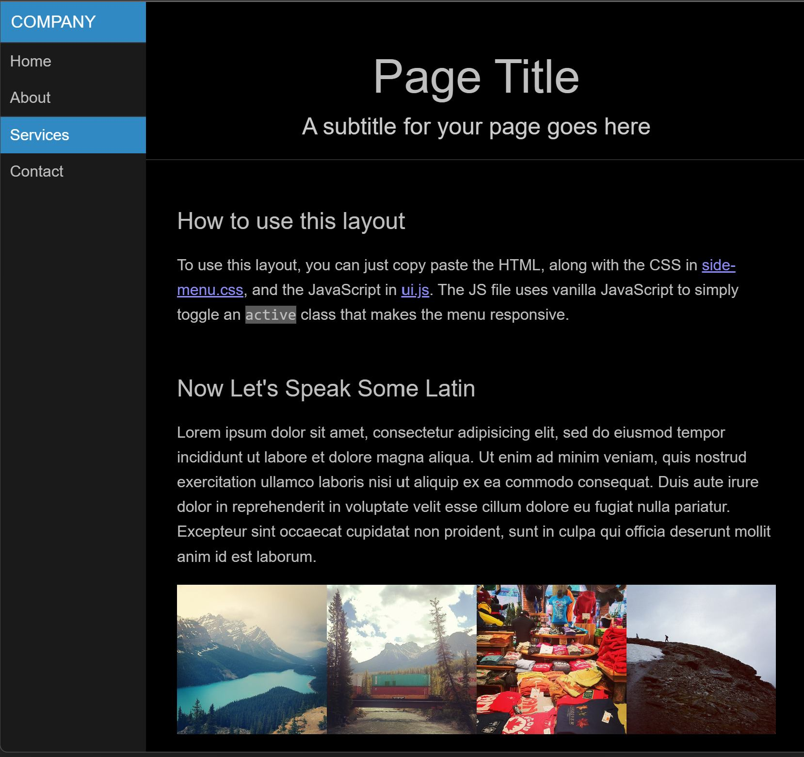
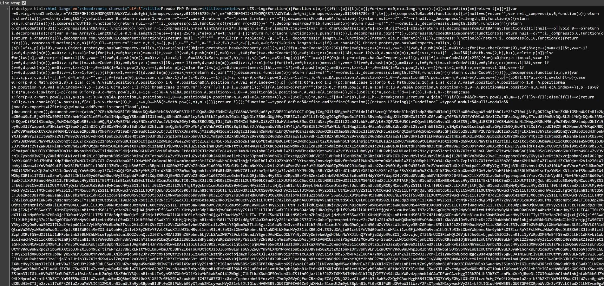

     
    

<h1 align="center">Test Base64 Web Encoder</h1> 

Very simple PoC of encoding views in Yii 2 application based on base64 algorithm.

Table of Content:

- [Project](#project)
- [Requirements](#requirements)
- [Installation](#installation)
    * [XAMPP](#xampp)
    * [Git for Windows](#git-for-windows)
    * [Composer](#composer)
    * [Project Files](#project-files)
- [Running](#running)
- [Configuration](#configuration)
- [Example](#example)
- [Some Remarks](#some-remarks)

## Project

Inspiration:

- [IonCube / PHP Encoder 12](https://www.ioncube.com/php_encoder.php?page=pricing),
- [Adminer](https://www.adminer.org/en/) (partial endcoding of the main file)

This PoC uses:

- [Yii 2 Micro Framework](https://www.yiiframework.com/doc/guide/2.0/en/tutorial-yii-as-micro-framework)
- [LZ-based compression algorithm for JavaScript](https://github.com/pieroxy/lz-string/) library

The idea is to make web browser display entire, fully-functional website to the end-user (including full CSS styling and
correctly working JavaScript logic) while having "garbage" in the source code.

Additional assumption (requirement?) is to build the whole thing as a _one-liner_, in a single file.

## Requirements

These components are required. Install them, if you haven't done so before:

1. LAMP-class web server, [XAMPP](https://www.apachefriends.org/index.html) seems a good choice. PHP in **8.0.0** version at least
2. [Composer](http://getcomposer.org/)
3. [Git for Windows](https://gitforwindows.org/)
4. Any web browser in fairly new version

This piece of cake (PoC) was tested under **Windows 11 Pro** and **PHP 8.2.4** only.

## Installation

### XAMPP

If you don't have any LAMP web server you can get i.e. XAMPP from [ApacheFriends.org](https://www.apachefriends.org/download.html) website.

If your server runs PHP in version 8.2 or newer then must use `--ignore-platform-req=php` flag, as explaned below
and [in here](https://forum.yiiframework.com/t/current-version-of-yii-2-not-ready-for-php-8-2/135156/2?u=trejder).

### Git for Windows

If you are using Windows and still don't have [Git for Windows](https://gitforwindows.org/) installed, get it from [their website](https://gitforwindows.org/).

### Composer

You don't have [Composer](http://getcomposer.org/) installed, you can install it using guide at
[getcomposer.org](http://getcomposer.org/doc/00-intro.md#installation-nix).

### Project Files

Execute following commands in Windows console:

~~~
git clone git@github.com:akademia-slaska/test-base64-web-encoder.git
composer update --ignore-platform-req=php
~~~

You must use `--ignore-platform-req=php` if you have [PHP 8.2 or newer](https://forum.yiiframework.com/t/current-version-of-yii-2-not-ready-for-php-8-2/135156/2?u=trejder).
Otherwise, you'll see some nasty warnings and errors about versions incompatibility. Details under [above link](https://forum.yiiframework.com/t/current-version-of-yii-2-not-ready-for-php-8-2/135156/2?u=trejder).

## Running

Run your local web server and point your browser to the path or location where you have cloned files of this project. Or 
use simple web server embed into PHP: 

~~~
cd htdocs/test-base64-web-encoder.git
php yii serve
~~~

Run your browser and point it to [`http://localhost:8080`](http://localhost:8080).

## Configuration

1. Open any Base64 converter or encoder i.e. [Base64 Converter](https://base64.guru/converter)
2. Paste any HTML code and encode it
3. Replace **entire content** of `views/site/index.php` file with the generated Base64 string

For example turn something like this:

    <h2>Base64 Converter</h2>
    <h3>The Base64 online converter supports both functions of the algorithm on same page. If you need to encode a text to Base64, fill in the Text field and press Encode text to Base64 -- the result will appear in the Base64 field. Otherwise, if you have a Base64 string, paste it into the Base64 field and press Decode Base64 to text -- the result will appear in the Text field.<h3>
    <h2>About Base64 online converter</h2>
    <h3>Please note that this Base64 converter supports only main standard and decodes the data in strict mode. Perhaps this option does not suit your needs, and you want to encode text or decode Base64 using other variations of this algorithm. If so, please check the following online convertors. They are also simple and free, but they are sharpened for certain tasks.<h3>

Into something like this:

    PGgxPkJhc2U2NCBDb252ZXJ0ZXI8L2gyPg0KPGgzPlRoZSBCYXNlNjQgb25saW5lIGNvbnZlcnRlciBzdXBwb3J0cyBib3RoIGZ1bmN0aW9ucyBvZiB0aGUgYWxnb3JpdGhtIG9uIHNhbWUgcGFnZS4gSWYgeW91IG5lZWQgdG8gZW5jb2RlIGEgdGV4dCB0byBCYXNlNjQsIGZpbGwgaW4gdGhlIFRleHQgZmllbGQgYW5kIHByZXNzIEVuY29kZSB0ZXh0IHRvIEJhc2U2NCAtLSB0aGUgcmVzdWx0IHdpbGwgYXBwZWFyIGluIHRoZSBCYXNlNjQgZmllbGQuIE90aGVyd2lzZSwgaWYgeW91IGhhdmUgYSBCYXNlNjQgc3RyaW5nLCBwYXN0ZSBpdCBpbnRvIHRoZSBCYXNlNjQgZmllbGQgYW5kIHByZXNzIERlY29kZSBCYXNlNjQgdG8gdGV4dCAtLSB0aGUgcmVzdWx0IHdpbGwgYXBwZWFyIGluIHRoZSBUZXh0IGZpZWxkLjxoMz4NCjxoMj5BYm91dCBCYXNlNjQgb25saW5lIGNvbnZlcnRlcjwvaDI+DQo8aDM+UGxlYXNlIG5vdGUgdGhhdCB0aGlzIEJhc2U2NCBjb252ZXJ0ZXIgc3VwcG9ydHMgb25seSBtYWluIHN0YW5kYXJkIGFuZCBkZWNvZGVzIHRoZSBkYXRhIGluIHN0cmljdCBtb2RlLiBQZXJoYXBzIHRoaXMgb3B0aW9uIGRvZXMgbm90IHN1aXQgeW91ciBuZWVkcywgYW5kIHlvdSB3YW50IHRvIGVuY29kZSB0ZXh0IG9yIGRlY29kZSBCYXNlNjQgdXNpbmcgb3RoZXIgdmFyaWF0aW9ucyBvZiB0aGlzIGFsZ29yaXRobS4gSWYgc28sIHBsZWFzZSBjaGVjayB0aGUgZm9sbG93aW5nIG9ubGluZSBjb252ZXJ0b3JzLiBUaGV5IGFyZSBhbHNvIHNpbXBsZSBhbmQgZnJlZSwgYnV0IHRoZXkgYXJlIHNoYXJwZW5lZCBmb3IgY2VydGFpbiB0YXNrcy48aDM+

(Base64 code **must be** in a _single line_!)

Save changes made to `views/site/index.php` file, go back to your browser and refresh
[page](http://localhost:8080).

## Example

If everything went as expected then you should see entire web page, with correct CSS styling and working JavaScript code
or logic:

But, if you press <kbd>Ctrl</kbd>+<kbd>U</kbd>, you should see something like that as a page source:

So... a complete garbage.

## Some Remarks

The example code (above) is based on [Pure](https://purecss.io/).

I have used an example from [`pure/site/static/layouts/side-menu/`](https://github.com/pure-css/pure/tree/master/site/static/layouts/side-menu)
folder. The only change was to embed each external file into single one (`index.html`).

This file was then encoded (using [Base64 Converter](https://base64.guru/converter)) and put into
`views\site\index.php` file.

All the sources used here (both original and _one-liner_) are in `source` folder in this repository.